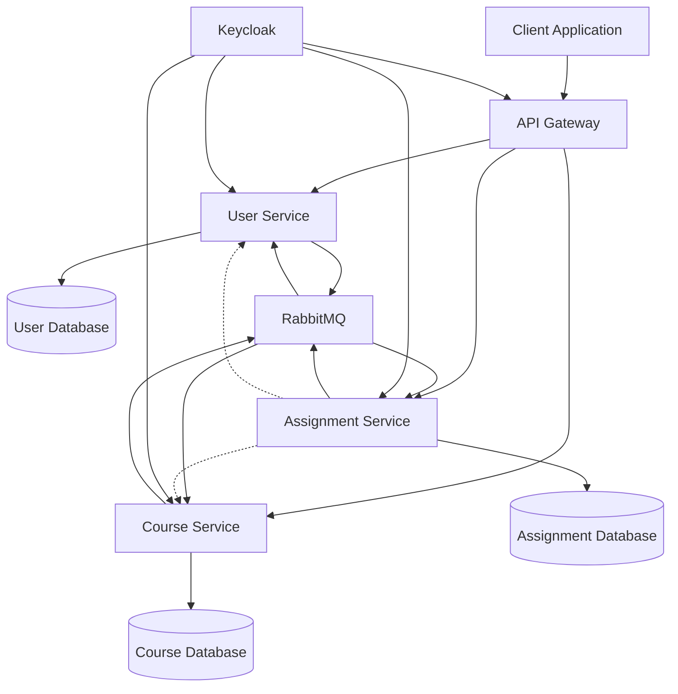
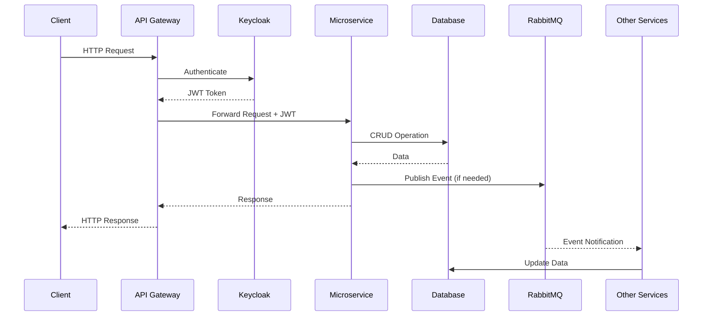
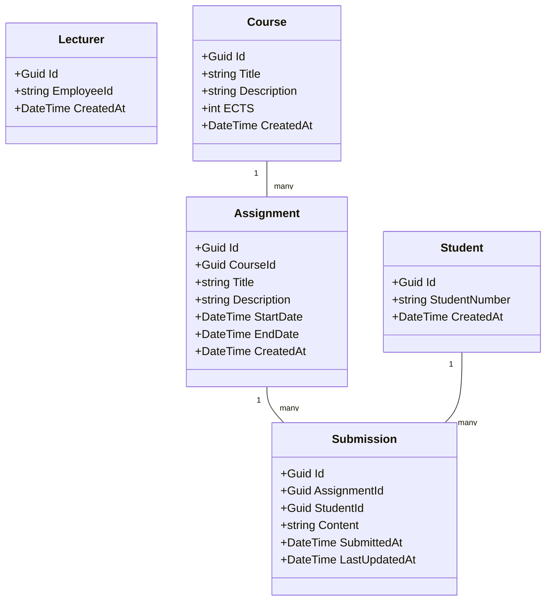
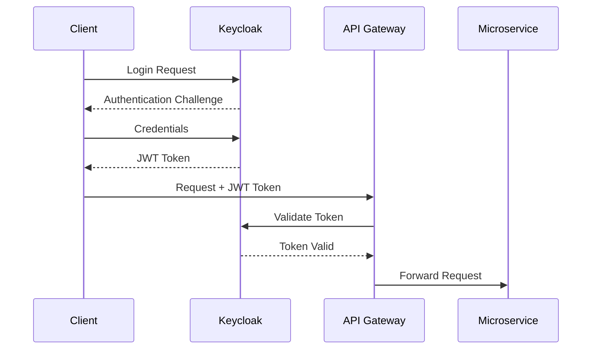
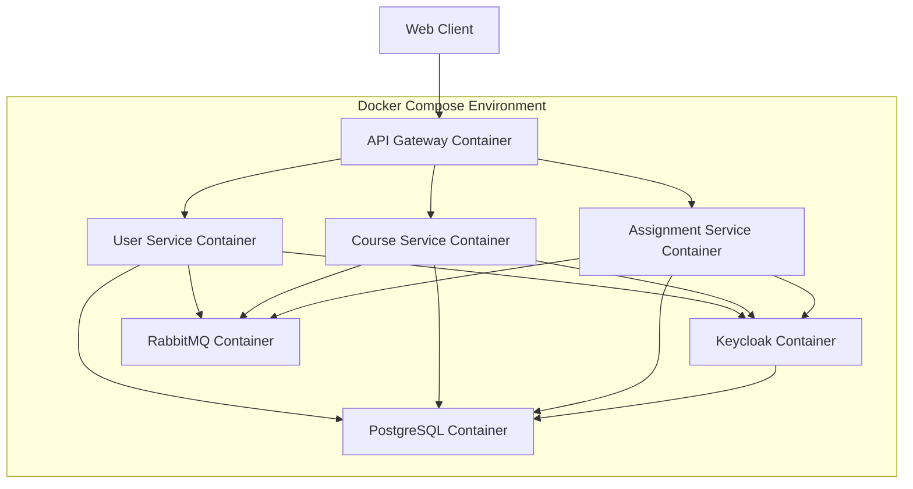

# UniversityApp - Microservices Educational Platform

A modern educational platform built with microservices architecture to manage university courses, assignments, and users.

## System Architecture

UniversityApp is designed as a microservices architecture with several independent services that communicate through both RESTful APIs and message-based communication.

### Architecture Overview



### Service Descriptions

#### API Gateway
- Entry point for all client requests
- Routes requests to appropriate microservices
- Implements Swagger integration for API documentation
- Uses Ocelot for routing configuration

#### User Service
- Manages student and lecturer data
- Handles user authentication via Keycloak
- Provides APIs for user management operations

#### Course Service
- Manages course information
- Handles course creation, updates, and deletion
- Publishes events when courses are deleted

#### Assignment Service
- Manages assignments related to courses
- Handles assignment submission
- Consumes events from the Course Service to maintain data consistency
- Communicates with User and Course services for verification

#### Shared Components
- Shared models and DTOs between services
- Common event definitions for message-based communication
- Utility classes and extensions

## Data Flow



## Domain Model



## Technology Stack

- **.NET 9**: Core framework for all services
- **PostgreSQL**: Database for each service
- **Docker & Docker Compose**: Containerization and orchestration
- **RabbitMQ**: Message broker for event-driven communication
- **Keycloak**: Authentication and authorization
- **Ocelot**: API Gateway
- **Entity Framework Core**: ORM for database operations
- **MassTransit**: Message bus abstraction
- **FluentValidation**: Input validation
- **Swagger/OpenAPI**: API documentation
- **Refit**: Type-safe HTTP client

## Service Communication

### REST API
- Services communicate via HTTP/HTTPS for synchronous operations
- API Gateway routes client requests to appropriate services

### Message-Based Communication
- Event-driven architecture using RabbitMQ
- Services publish events when significant state changes occur
- Other services subscribe to relevant events and react accordingly

Example events:
- `CourseDeletedEvent`: Published when a course is deleted
- `AssignmentDeletedEvent`: Published when an assignment is deleted
- `AssignmentsDeletedEvent`: Published when multiple assignments are deleted

## Authentication & Authorization

Authentication is handled by Keycloak, an open-source Identity and Access Management solution.

### Authentication Flow



### Role-Based Authorization

The system supports various roles:
- **Student**: Can view courses, submit assignments
- **Lecturer**: Can create/manage courses and assignments
- **Admin**: Full system access

## Deployment

The entire system is containerized using Docker and can be deployed with Docker Compose.



## Keycloak Configuration

To configure Keycloak for this project, follow these steps:

1. **Create Realm**
   - Log into Keycloak Admin Console (http://localhost:8080)
   - Create a new realm called "university"

2. **Configure Realm Settings**
   - Go to Realm Settings -> Login
   - Enable the following options:
     - User registration
     - Forgot password
     - Remember me
     - Email as username
     - Login with email

3. **Create Client**
   - Go to Clients -> Create Client
   - Set Client ID to "university-frontend-app"
   - Click Next
   - Enable "Standard flow"
   - Click Next
   - Set Valid redirect URIs to "https://localhost:5001/*"
   - Set Web origins to "https://localhost:5001"
   - Click Save

4. **Configure Swagger**
   - In Swagger UI, all scopes should be enabled
   - The client ID should be entered as "university-frontend-app"

## Getting Started

### Prerequisites

- Docker and Docker Compose
- .NET 9 SDK (for development)

### Running the Application

1. Clone the repository
2. From the root directory, run:

```bash
docker-compose up -d
```

3. Access the services:
   - API Gateway: https://localhost:5001
   - Keycloak: http://localhost:8080
   - RabbitMQ Management: http://localhost:15672 (guest/guest)

## Development Guidelines

### Service Structure

Each microservice follows a similar structure:
- **Controllers**: API endpoints
- **Services**: Business logic
- **Repositories**: Data access
- **Models**: Domain entities
- **DTOs**: Data transfer objects
- **Validators**: Input validation

### Database Migrations

Each service manages its own database schema using Entity Framework Core migrations.

### Adding a New Service

1. Create a new .NET project
2. Add references to the Shared project
3. Configure database connection
4. Configure Keycloak authentication
5. Configure RabbitMQ connection
6. Add necessary controllers, services, and repositories
7. Update the API Gateway configuration
8. Update Docker Compose file

## Contributing

1. Fork the repository
2. Create a feature branch
3. Submit a pull request

## License

This project is licensed under the MIT License.